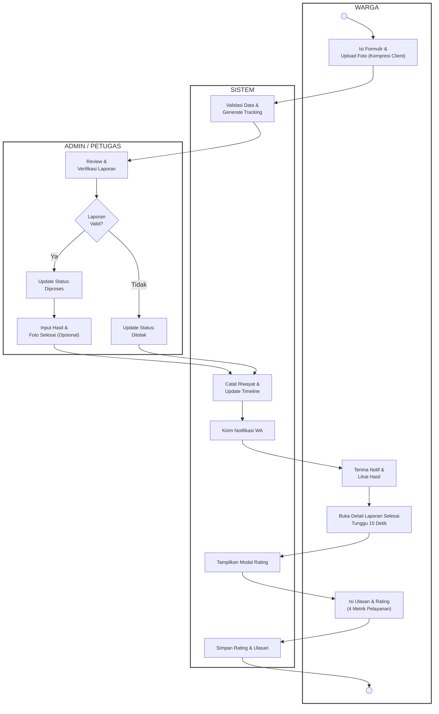
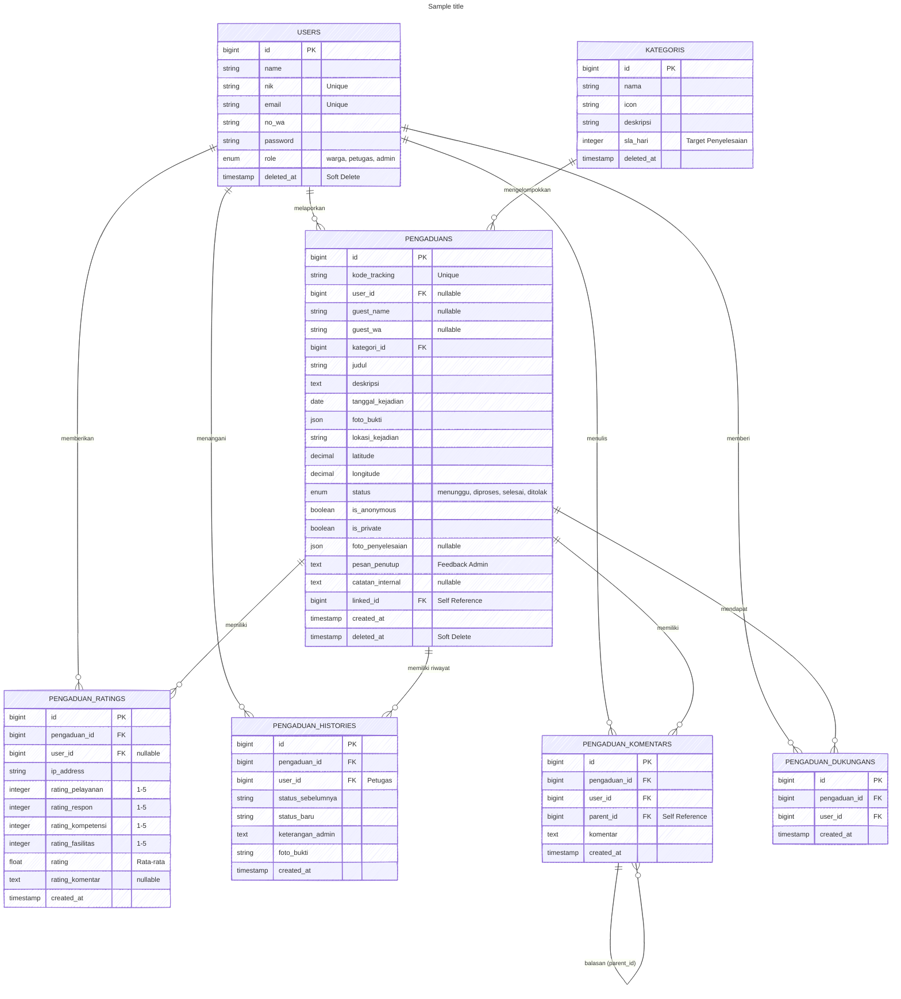
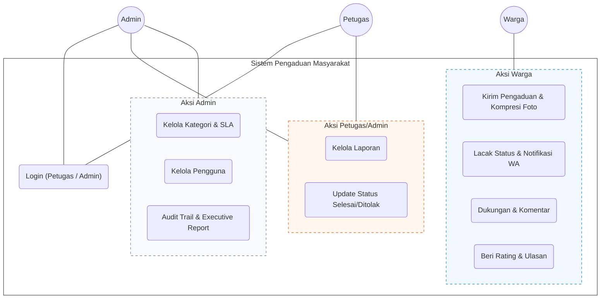
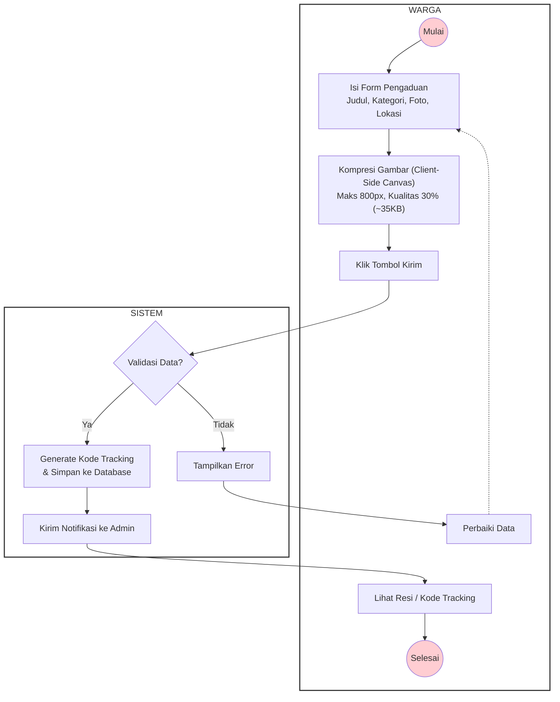
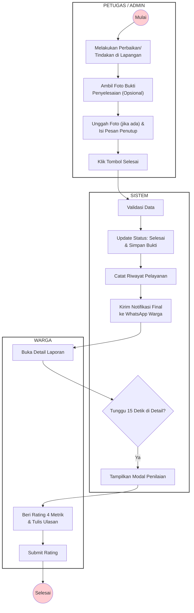
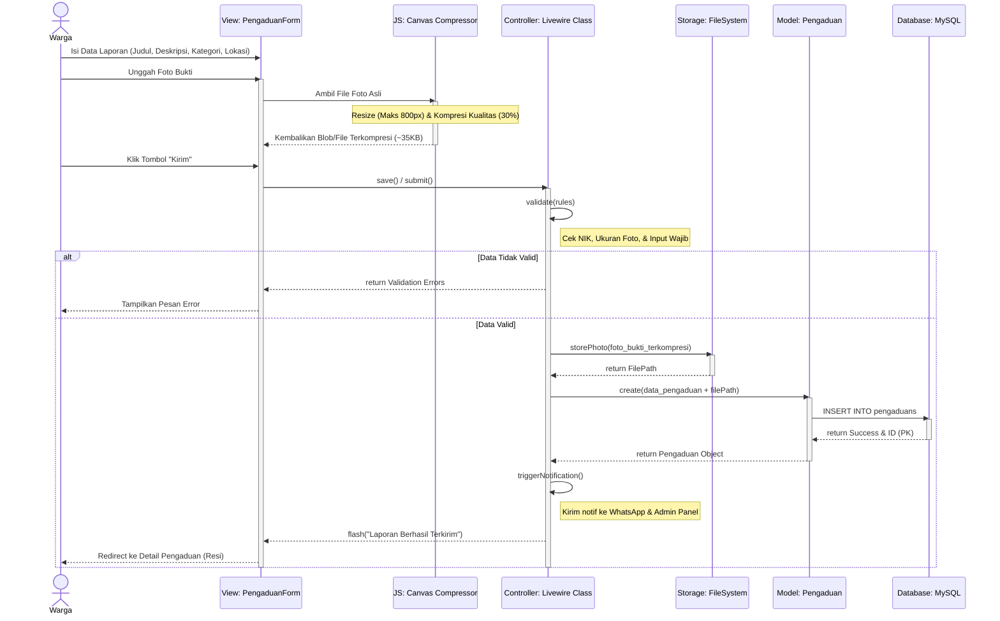

# Diagram Sistem Kembaran Ngadu (Mermaid.js) 📊

Dokumen ini berisi kumpulan diagram sistem **Kembaran Ngadu** yang ditulis dalam format **Mermaid.js** sesuai dengan standar rendering Mermaid Live.

---

## 1. Activity Diagram (Global)



---

## 2. Entity Relationship Diagram (ERD)



---

## 3. Use Case Diagram



---

## 4. Activity Diagram Pengiriman Laporan oleh Warga



---

## 5. Activity Diagram Penanganan Laporan (Validasi)

```mermaid
%%{init: {'theme': 'base', 'themeVariables': { 'subgraphPadding': 10 }}}%%
flowchart TD
    %% Kolom Admin
    subgraph Kolom_Admin [ADMIN / PETUGAS]
        A_Start((Mulai)) --> A_View[Buka Dashboard &<br/>Pilih Laporan Baru]
        A_View --> A_Review[Review Foto & Lokasi]
        A_Review --> A_Decision{Valid?}
        
        A_Decision -- Tidak --> A_Reject[Input Alasan &<br/>Klik Tolak]
        A_Decision -- Ya --> A_Accept[Klik Proses &<br/>Set Prioritas]
    end

    %% Kolom Sistem
    subgraph Kolom_Sistem [SISTEM]
        A_Reject --> S_Status_Reject[Update Status: Ditolak<br/>& Simpan Alasan]
        A_Accept --> S_Status_Process[Update Status: Diproses<br/>& Catat History]
        
        S_Status_Reject --> S_Notify[Kirim Notifikasi<br/>ke Warga]
        S_Status_Process --> S_Notify
    end

    %% Selesai
    S_Notify --> A_End((Selesai))

    %% Penyelarasan
    A_Start ~~~ S_Status_Reject

    %% Styling
    style A_Start fill:#000
    style A_End fill:#000
    style Kolom_Admin fill:#fff,stroke:#333,stroke-width:2px
    style Kolom_Sistem fill:#fff,stroke:#333,stroke-width:2px
```



---

## 6. Activity Diagram Penyelesaian & Umpan Balik



---

## 7. Sequence Diagram Proses Kirim Pengaduan



---

## 8. Sequence Diagram Update Status & Umpan Balik Rating

```mermaid
---
config:
  theme: default
---
sequenceDiagram
    actor A as Admin / Petugas
    actor W as Warga
    participant V as View: PengaduanDetail
    participant C as Controller: Admin/User Class
    participant M1 as Model: Pengaduan
    participant M2 as Model: PengaduanHistory
    participant MR as Model: PengaduanRating
    database DB as Database: MySQL
    participant N as System: Notification

    A->>V: Pilih Status Baru (Selesai)
    A->>V: Input Catatan / Foto Hasil (Opsional)
    A->>V: Klik "Update Status"
    activate V
    V->>C: updateStatus(status, catatan)
    activate C
    C->>C: validate()
    Note over C, DB: Start Transaction
    C->>M1: update(status_baru)
    activate M1
    M1->>DB: UPDATE pengaduans SET status = 'selesai'
    activate DB
    DB-->>M1: return Success
    deactivate DB
    M1-->>C: updated
    deactivate M1
    C->>M2: create(log_riwayat)
    activate M2
    M2->>DB: INSERT INTO pengaduan_histories
    activate DB
    DB-->>M2: return Success
    deactivate DB
    M2-->>C: history_created
    deactivate M2
    Note over C, DB: Commit Transaction
    C->>N: sendStatusNotification(user_id)
    activate N
    N-->>C: WhatsApp Notif Sent
    deactivate N
    C-->>V: emit("statusUpdated")
    deactivate C
    V-->>A: Refresh & Tampilkan Status Selesai
    deactivate V

    W->>V: Klik Link Notifikasi WA / Kunjungi Detail Laporan Selesai
    activate V
    V->>V: Hitung Delay 15 Detik
    Note over V: Auto-Popup modal rating terpicu
    V-->>W: Tampilkan Modal Penilaian
    W->>V: Isi 4 Metrik Bintang & Komentar
    W->>V: Klik "Kirim Penilaian"
    V->>C: submitRating(pelayanan, respon, kompetensi, fasilitas, ulasan)
    activate C
    C->>MR: create(rating_data)
    activate MR
    MR->>DB: INSERT INTO pengaduan_ratings
    activate DB
    DB-->>MR: return Success
    deactivate DB
    MR-->>C: rating_created
    deactivate MR
    C-->>V: Refresh rating container
    deactivate C
    V-->>W: Tampilkan ulasan terkirim & Refresh list ulasan (Alpine pagination)
    deactivate V
```
